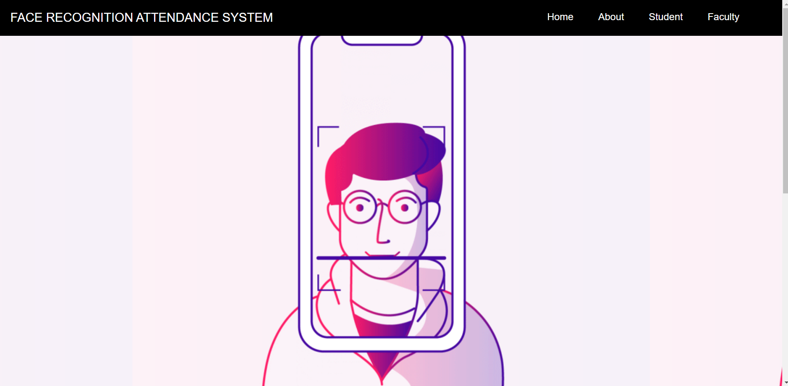
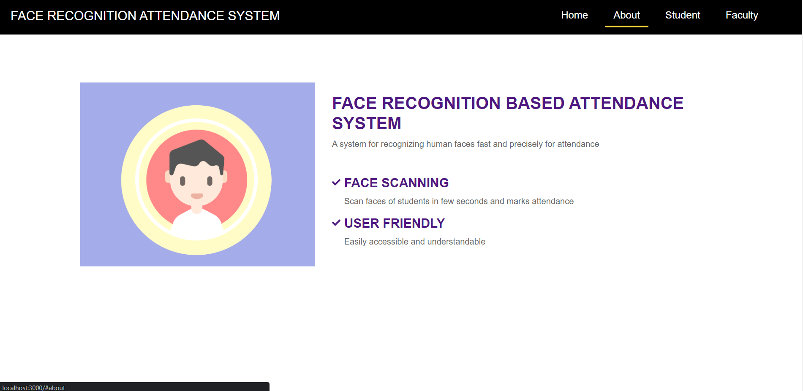

<div align="center">
<h1 align="center">Face Recognition Attendance System</h1>


</div>

<!-- TABLE OF CONTENTS -->
<details open="open">
  <summary>Table of Contents</summary>
  <ol>
    <li>
      <a href="#about-the-project">About The Project</a>
      <ul>
        <li><a href="#salient-features">Salient Features</a></li>
        <li><a href="#compatible-platforms">Compatible Platforms</a></li>
        <li><a href="#built-with">Built With</a></li>
      </ul>
    </li>
    <li>
      <a href="#agile-methodology">Agile Methodology</a>
      <ul>
        <li><a href="#what-is-agile">What is Agile</a></li>
        <li><a href="#how-i-incorporated-agile-methodology-during-the-development-cycle">How I Incorporated Agile Methodology During The Development Cycle</a></li>
      </ul>
    </li>
    <li>
      <a href="#getting-started">Getting Started</a>
      <ul>
        <li><a href="#points-to-remember-while-testing-the-app">Points to remember while testing the app</a></li>
        <li><a href="#before-installation">Before Installation</a></li>
        <li><a href="#installation">Installation</a></li>
      </ul>
    </li>
    <li><a href="#navigating-through-the-app">Navigating through the App</a></li><ul>
        <li><a href="#home-page-and-about-section">Home page and About Section</a></li>
        <li><a href="#student-and-faculty-registration">Registration</a></li>
        <li><a href="#student-and-faculty-login">Login</a></li>
        <li><a href="#student-and-faculty-profile-page">Profile Page</a></li>
        <li><a href="#generate-code-and-send-email">Generate Code and Send Email</a></li>
        <li><a href="#authenticate-code-and-mark-attendance">Marking Attendance</a></li>
        <li><a href="#view-daily-and-datewise-attendance-sheet">Attendance Sheet</a></li>
        <li><a href="#chatbox-feature">ChatBox</a></li>
      </ul>
    <li><a href="#need-help">Need Help?</a></li>
  </ol>
</details>

<!-- ABOUT THE PROJECT -->

## About The Project
* Face Recognition Attendance System built during Microsoft Engage 2022. 
* The project aims to eliminate the current conventional attendance system which is done manually. 
* It detects and matches student face to mark attendance automatically.
* The faculty generates the unique authentication code which is validated on student side to mark attendance.

### Salient Features
* Capturing student image at the time of registration later used to detect face and mark attendance.
* Sending class details email using Nodemailer, editing profile, viewing daily and date-wise attendance sheet as well as the no. of lectures and percentage attendance of each student.
* Sending email automatically to all students absent for the class.
* ChatBox - Feature through which the student and faculty can directly chat with each other implemented using Socket.io
* Dynamic Profile page of Student and faculty showing all their details.

### Compatible Platforms
Laptops, Desktops and Tablet PCs

### Built With
* ![Front-end][front-end-shield]
* ![Back-end][back-end-shield]
* ![Database][database-shield]
* ![Tools][tools-shield]

<!-- AGILE METHODOLOGY -->
## Agile Methodology

### What is Agile

Agile is a development methodology adopted today in the software industry. Agile promotes teamwork, flexible procedures, and sle-organizing teams.

### How I Incorporated Agile Methodology During The Development Cycle

SCRUM is a subset of Agile, a framework for developing software. SCRUM takes advantage of different techniques to achieve goals in Agile. SCRUM promotes an iterative model where the planning is performed on a very short term. The basic time working unit is the sprint. SCRUM teams always reason in sprints and their planning is limited to sprints.

* Sprint 1 (May 4 - May 11): Sprint Planning, Research and Design - Out of the three challenges i.e Face Recognition, Data Analysis and Recommendation System, I decided to build a Face Recognition based Attendance System. I researched about various faceAPI available such as Microsoft Azure, Headtracker, OpenCV, etc. but I decided to stick with JavaScript FaceAPI which is implemented on top of tensorflow.js core API. After that, I searched for tutorials, designed a wireframe including the functionalities I want and designed the UI.

* Sprint 2 (May 12 - May 18): Software development and debugging - Started the development process by taking help from YouTube tutorials. Built a web application using React JS and Node JS and implemented socket.io for the first time. Encountered occasional bugs which I debugged timely. Made required changes in the UI and color scheme to make it more eye pleasing.

* Sprint 3 (May 19 - May 29): Implementing ChatBox Feature - debugging and adding additional features. I decided to implement ChatBox feature after successfully implementing the face recognition functionality. Added Logout functionality, viewing attendance sheets and sending email to the absentees. Finalised the UI of the project and successfully deployed it.

<!-- INSTALLATIONS -->

## Points to remember while testing the app
1. Allow permission for camera.
2. Wait for the models to load to detect face while marking the attendance.
3. Make sure you sit close to the camera with your face clearly visible at the time of marking attendance.
4. Make sure to capture clear image, with face clearly visible at the time of registration of Student.


## Before Installation
1. Set up your .env file variables in the server folder.
2. Replace the MONGO_URL with your own MongoDB url. Refer to https://medium.com/featurepreneur/how-to-create-a-cluster-in-mongodb-28996662b3ac to create your cluster and set up your database.
3. Replace EMAIL and PASS with your own email id and password you want to use for Nodemailer.
4. Replace OAUTH_CLIENTID, OAUTH_CLIENT_SECRET and OAUTH_REFRESH_TOKEN with your own Google Cloud API Credentials. Refer to https://dev.to/chandrapantachhetri/sending-emails-securely-using-node-js-nodemailer-smtp-gmail-and-oauth2-g3a to create your OAUTH Credentials. 


<!-- APP TUTORIAL-->
## Navigating Through The App

## Home Page and About Section

   - Home Page of the website. The project is divided into two modules - Student and Faculty.
   
    
   
   - About Section. The project provides face scanning to mark attendance and is very User friendly.
   
   
   

   


## Need Help?


---------

```javascript
if (youEnjoyed) {
    starThisRepository();
}
```

-----------

<!--MARKDOWN LINKS-->
[front-end-shield]: https://img.shields.io/badge/Front--end-React%20JS-blueviolet
[back-end-shield]: https://img.shields.io/badge/Back--end-Node%20JS%2C%20Express%2C%20socket.io-blueviolet
[tools-shield]: https://img.shields.io/badge/Tools-JavaScript%20FaceAPI-blueviolet
[database-shield]: https://img.shields.io/badge/Database-MongoDB-blueviolet
